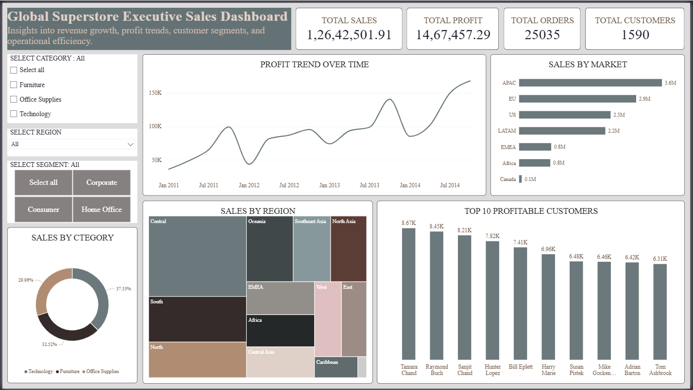

<div align="center">

# 🌍 Global Superstore Executive Sales Dashboard

[](https://powerbi.microsoft.com/)
[](https://www.microsoft.com/excel)
[]()
[](https://opensource.org/licenses/MIT)

[](https://github.com/)
[]()
[]()

> *Insights into revenue growth, profit trends, customer segments, and operational efficiency.*

</div>

---

## 📌 Overview

The **Global Superstore Executive Sales Dashboard** is an interactive Power BI report built on the Global Superstore dataset. It provides a 360° view of sales performance across markets, regions, segments, and product categories — empowering business leaders to make data-driven decisions at a glance.

---

## 📸 Dashboard Preview



---

## 📊 Key Metrics at a Glance

| 📦 Metric | 🔢 Value |
|---|---|
| 💰 **Total Sales** | $1,26,42,501.91 |
| 📈 **Total Profit** | $14,67,457.29 |
| 🛒 **Total Orders** | 25,035 |
| 👥 **Total Customers** | 1,590 |

---

## 🗂️ Dashboard Components

### 1. 📉 Profit Trend Over Time
Tracks monthly profit from **Jan 2011 to Jul 2014**, highlighting seasonal patterns, dips, and growth spurts to identify business cycles.

### 2. 🌐 Sales by Market
Horizontal bar chart ranking all global markets:

| Market | Sales |
|--------|-------|
| 🥇 APAC | 3.6M |
| 🥈 EU | 2.9M |
| 🥉 US | 2.3M |
| LATAM | 2.2M |
| EMEA | 0.8M |
| Africa | 0.8M |
| Canada | 0.1M |

### 3. 🗺️ Sales by Region (Treemap)
A treemap visualization breaking down sales by region — **Central, South, North, Oceania, Southeast Asia, North Asia, EMEA, West, East, Africa, Central Asia, Caribbean** — sized proportionally by revenue contribution.

### 4. 🍩 Sales by Category (Donut Chart)
| Category | Share |
|----------|-------|
| 🖥️ Technology | 37.53% |
| 🪑 Furniture | 32.52% |
| 📎 Office Supplies | 29.96% |

### 5. 🏆 Top 10 Profitable Customers
Ranked bar chart spotlighting the most valuable customers by profit generated:

> Tamara Chand · Raymond Buch · Sanjit Chand · Hunter Lopez · Bill Eplett · Harry Marie · Susan Pistek · Mike Gockern · Adrian Barton · Tom Ashbrook

---

## 🎛️ Interactive Filters

The dashboard includes dynamic slicers to drill down into the data:

- **📦 Category Filter** — All / Furniture / Office Supplies / Technology
- **🌍 Region Filter** — Dropdown for all global regions
- **👤 Segment Filter** — Corporate / Consumer / Home Office

---

## 📁 Project Files

```
📦 Global-Superstore-Dashboard
 ┣ 📊 Global_Superstore_Dashboard.pbix   ← Power BI Report File
 ┣ 📂 Global_Superstore.xlsx             ← Raw Dataset
 ┣ 🖼️  Dashboard.png                     ← Dashboard Screenshot
 ┗ 📄 README.md                          ← Project Documentation
```

---

## 🛠️ Tools & Technologies


- **Power BI Desktop** — Dashboard design & visualization
- **Microsoft Excel** — Data source & preprocessing
- **DAX** — Calculated measures and KPIs
- **Power Query** — Data transformation and cleaning

---

## 🚀 Getting Started

### Prerequisites
- [Power BI Desktop](https://powerbi.microsoft.com/desktop/) installed

### Steps

```bash
# 1. Clone this repository
git clone https://github.com/your-username/global-superstore-dashboard.git

# 2. Navigate to the project folder
cd global-superstore-dashboard

# 3. Open the Power BI file
start Global_Superstore_Dashboard.pbix
```

> ⚠️ Ensure the `Global_Superstore.xlsx` file is in the same directory as the `.pbix` file to avoid broken data source errors.

---

## 💡 Key Insights

- 🌏 **APAC leads** all markets with $3.6M in sales — a strategic growth priority
- 📈 **Profit grew consistently** from 2011 to 2014, with a sharp rise in late 2013–2014
- 🖥️ **Technology** is the highest-revenue category at 37.53% of total sales
- 🏅 **Tamara Chand** is the most profitable customer with $8.67K in profit contribution
- 🌍 **Central region** dominates the regional treemap, suggesting concentrated market strength

---

## 📬 Contact

<div align="center">

[](https://github.com/)
[](https://linkedin.com/)
[](mailto:your-email@example.com)

*Feel free to reach out for collaboration, feedback, or questions!*

</div>

---

<div align="center">

⭐ **If you found this project helpful, please give it a star!** ⭐

Made with ❤️ by **RENSEE GAJIPARA**

</div>
